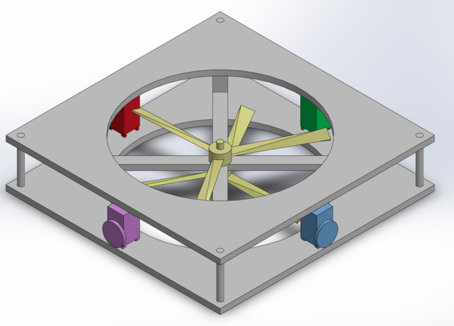
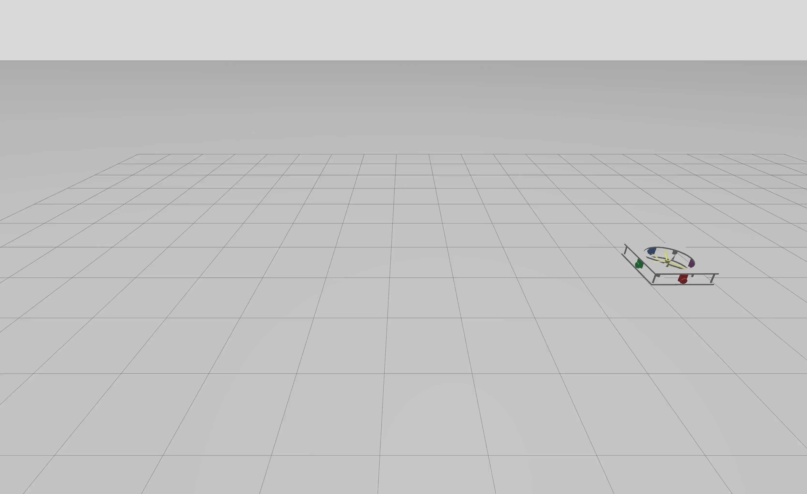
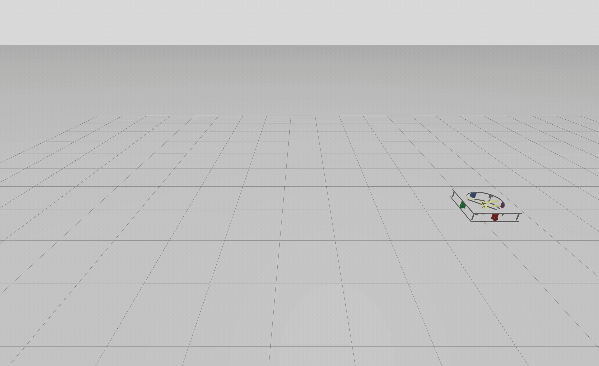

# MMC UAV Simulation

Public ROS 2 / Gazebo simulation source code for a moving-mass-controlled
coaxial UAV. This repository keeps the open-source simulation subset used for
the paper's validation scenarios: controller code, custom wind interfaces, UAV
description resources, a CAD/model view, and recorded demonstration videos for
Experiments A, B, and D.

> Status: public simulation subset. The full development workspace, logs,
> manuscript assets, and historical experiment artifacts are intentionally not
> included here.

## MMC UAV model

<p align="center">
  
</p>

## Demo videos

The GIFs below are converted from the full original video frame and full video
duration without manual cropping or resizing. Click any GIF to open the
corresponding MP4 file in the repository.

### Experiment A — nominal A→B point transfer and hold

<p align="center">
  <a href="videos/experiment_a_ab_hold.mp4">
    
  </a>
</p>

<p align="center">
  Full video: <a href="videos/experiment_a_ab_hold.mp4">experiment_a_ab_hold.mp4</a>
</p>

### Experiment B — A→B transfer with coordinated yaw-step hold

<p align="center">
  <a href="videos/experiment_b_ab_yaw_step.mp4">
    
  </a>
</p>

<p align="center">
  Full video: <a href="videos/experiment_b_ab_yaw_step.mp4">experiment_b_ab_yaw_step.mp4</a>
</p>

### Experiment D — 3 m/s wind disturbance with NDO enabled

<p align="center">
  <a href="videos/experiment_d_wind_ndo_on.mp4">
    
  </a>
</p>

<p align="center">
  Full video: <a href="videos/experiment_d_wind_ndo_on.mp4">experiment_d_wind_ndo_on.mp4</a>
</p>

The recorded MP4 files are stored under [`videos/`](videos/), and additional
scenario notes live in [`docs/experiments/README.md`](docs/experiments/README.md).

## Repository layout

```text
src/
  mmc_control/          ROS 2 Python controller, launch file, bridge config, visualizer
  mmc_interfaces/       Custom wind command/status messages
  mmc_uav_description/  URDF, meshes, and Gazebo worlds

docs/
  experiments/          Validation scenario notes and launch recipes
  media/                CAD/model image, preview GIFs, and poster images

videos/                 Recorded A/B/D demonstration MP4 files
```

## What is intentionally excluded

- Historical `fly_data` CSV logs and generated plots.
- Paper PDFs, LaTeX files, review images, and manuscript figures.
- `build/`, `install/`, `log/`, caches, and other development artifacts.
- Vendored copies of standard ROS/Gazebo dependencies.
- Large raw capture projects beyond the curated A/B/D demo videos.

## Dependencies

This project expects a ROS 2 + Gazebo Sim environment with `colcon` and the
standard ROS/Gazebo bridge packages. Package names vary by ROS/Gazebo distro;
the runtime dependency set is:

- ROS 2 launch/client libraries: `launch`, `launch_ros`, `rclpy`
- ROS messages: `geometry_msgs`, `nav_msgs`, `sensor_msgs`, `std_msgs`,
  `builtin_interfaces`, `actuator_msgs`, `rosgraph_msgs`,
  `visualization_msgs`
- Gazebo bridge/interfaces: `ros_gz_bridge`, `ros_gz_interfaces`
- Python libraries: `numpy`, `scipy`, `pandas`, `matplotlib`, `casadi`,
  `osqp`
- Gazebo Python transport bindings used by the wind bridge:
  `python3-gz-transport13`
- Optional visualization/teleoperation tools: `plotjuggler`, `tkinter`,
  `pynput`

If `casadi` or `osqp` is not provided by your ROS/Gazebo distribution packages,
install them in your active Python environment, for example:

```bash
python3 -m pip install -r requirements.txt
```

## Build

From the repository root:

```bash
source /opt/ros/<distro>/setup.bash
colcon build --symlink-install
source install/setup.bash
```

## Default simulation entry point

```bash
ros2 launch mmc_control mmc_launch.py
```

Current default baseline: Experiment D with the 3 m/s move-start-activated wind
world, a 1.5 s wind ramp, wind bridge enabled, NDO enabled, Gazebo GUI enabled,
and RViz disabled.

The launch file resolves resources from installed package shares, so it should
not depend on the original development workspace path. Generated flight logs
are written under `fly_data/` relative to `MMC_CONTROL_ROOT` when that
environment variable is set, otherwise relative to the source package root for
source-tree runs or the current working directory for installed runs.

## Paper validation scenarios

The paper validation section uses four scenario families:

- Experiment A: A--B point transfer and holding. Demo video included.
- Experiment B: A--B point transfer and holding with a yaw-step hold. Demo
  video included.
- Experiment C: parameter scans under the nominal A--B task.
- Experiment D: A--B point transfer and holding under wind disturbance, with
  NDO on/off comparisons. Demo video included.

See [`docs/experiments/README.md`](docs/experiments/README.md) for the launch
recipes and scenario notes.

## License

MIT. See `LICENSE`.
