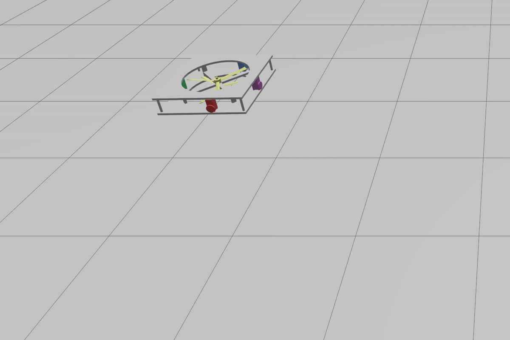
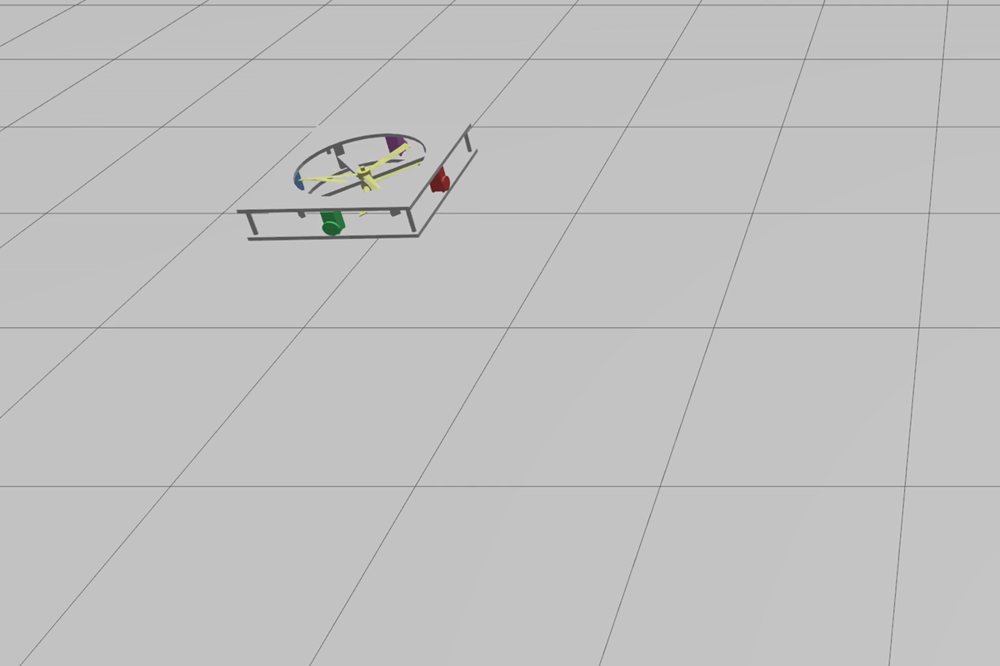
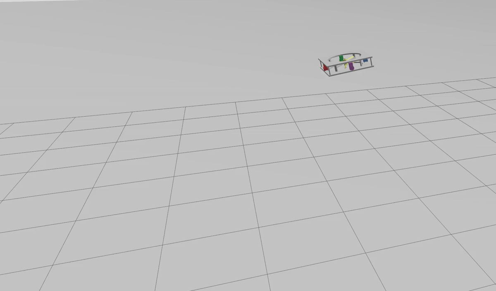

# Validation experiments

This directory documents the simulation experiment families used for the paper
validation section. Recorded demonstrations cover Experiments A, B, and D, and
Experiment C provides parameter-scan launch examples.

Current default launch baseline: Experiment D with the 3 m/s move-start-activated
wind world, a 1.5 s wind ramp, wind bridge enabled, NDO enabled, Gazebo GUI
enabled, and RViz disabled.

## Recorded demonstrations

| Scenario | Preview | Video |
| --- | --- | --- |
| Experiment A | [](../../videos/experiment_a_ab_hold.mp4) | [`experiment_a_ab_hold.mp4`](../../videos/experiment_a_ab_hold.mp4) |
| Experiment B | [](../../videos/experiment_b_ab_yaw_step.mp4) | [`experiment_b_ab_yaw_step.mp4`](../../videos/experiment_b_ab_yaw_step.mp4) |
| Experiment D | [](../../videos/experiment_d_wind_ndo_on.mp4) | [`experiment_d_wind_ndo_on.mp4`](../../videos/experiment_d_wind_ndo_on.mp4) |

## Experiment A — nominal A--B point transfer and holding

Purpose: validate nominal spatial tracking and final holding accuracy.

Suggested launch after building and sourcing this workspace:

```bash
ros2 launch mmc_control mmc_launch.py \
  auto_scene_mode:=hover_to_point_hold \
  world_sdf_path:=$(ros2 pkg prefix mmc_uav_description)/share/mmc_uav_description/worlds/empty_world.sdf \
  enable_wind_bridge:=false
```

Optional recording-tuning arguments:

```bash
ros2 launch mmc_control mmc_launch.py \
  auto_scene_mode:=hover_to_point_hold \
  auto_scene_target_y:=3.0 \
  auto_scene_target_z:=2.0 \
  auto_scene_hover_hold_time:=3.0 \
  auto_scene_move_duration:=6.0
```

## Experiment B — A--B transfer plus yaw-step hold

Purpose: validate translation--yaw coordination under the shared constrained
input domain.

Suggested launch:

```bash
ros2 launch mmc_control mmc_launch.py \
  world_sdf_path:=$(ros2 pkg prefix mmc_uav_description)/share/mmc_uav_description/worlds/empty_world.sdf \
  enable_wind_bridge:=false \
  auto_scene_mode:=hover_to_point_yaw_step_hold \
  auto_scene_yaw_step_deg:=90.0 \
  auto_scene_yaw_ramp_duration:=6.0
```

## Experiment C — parameter scans under the nominal A--B task

Purpose: compare moving-mass actuator bandwidth and individual moving-mass
settings under the same point-transfer task.

Example bandwidth scan:

```bash
for wn in 10.0 20.0 30.0; do
  ros2 launch mmc_control mmc_launch.py \
    auto_scene_mode:=hover_to_point_hold \
    slider_wn_mass:=${wn}
done
```

Example mass-ratio scan:

```bash
for m in 0.035 0.050 0.075; do
  ros2 launch mmc_control mmc_launch.py \
    auto_scene_mode:=hover_to_point_hold \
    moving_mass_kg:=${m}
done
```

## Experiment D — wind disturbance and NDO on/off comparison

Purpose: compare disturbance-compensation benefit and resource cost under
constant wind with turbulence.

Example for the 3 m/s wind world. The first command uses the current defaults;
the following commands spell out the NDO-on and NDO-off comparison variants.
Wind activates at move start and ramps from 0 to 3 m/s over 1.5 s:

```bash
WORLD=$(ros2 pkg prefix mmc_uav_description)/share/mmc_uav_description/worlds/wind_x3_hover_hold_world.sdf

ros2 launch mmc_control mmc_launch.py

ros2 launch mmc_control mmc_launch.py \
  world_sdf_path:=${WORLD} \
  enable_wind_bridge:=true \
  ndo_enabled:=true

ros2 launch mmc_control mmc_launch.py \
  world_sdf_path:=${WORLD} \
  enable_wind_bridge:=true \
  ndo_enabled:=false
```

For the 5 m/s case, replace the world with
`wind_x5_hover_hold_world.sdf`.
